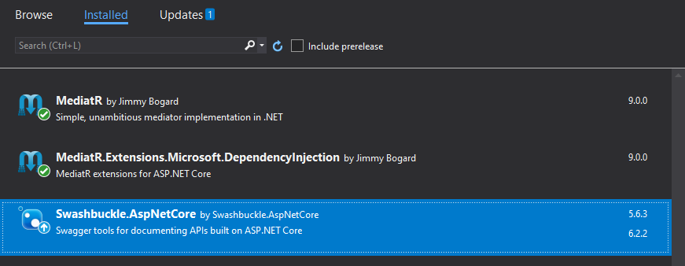
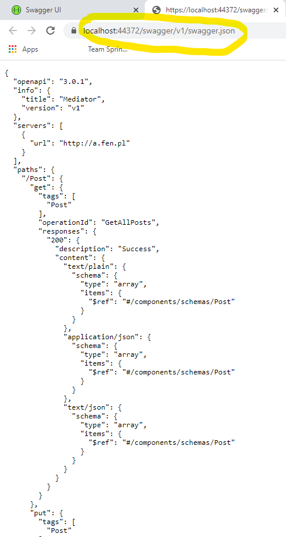
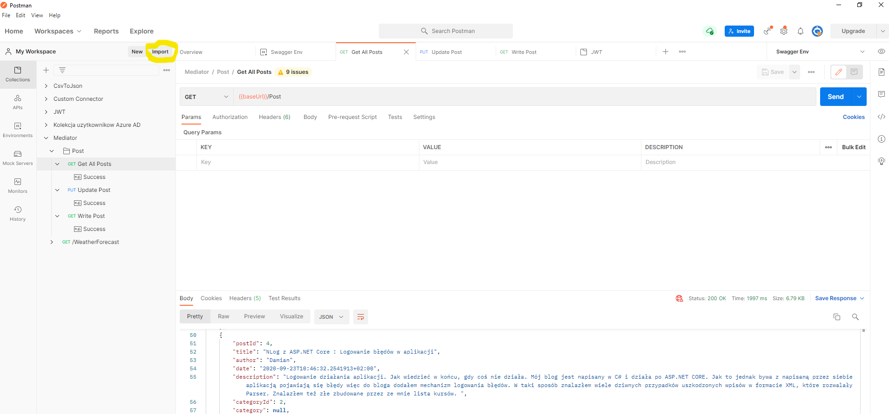
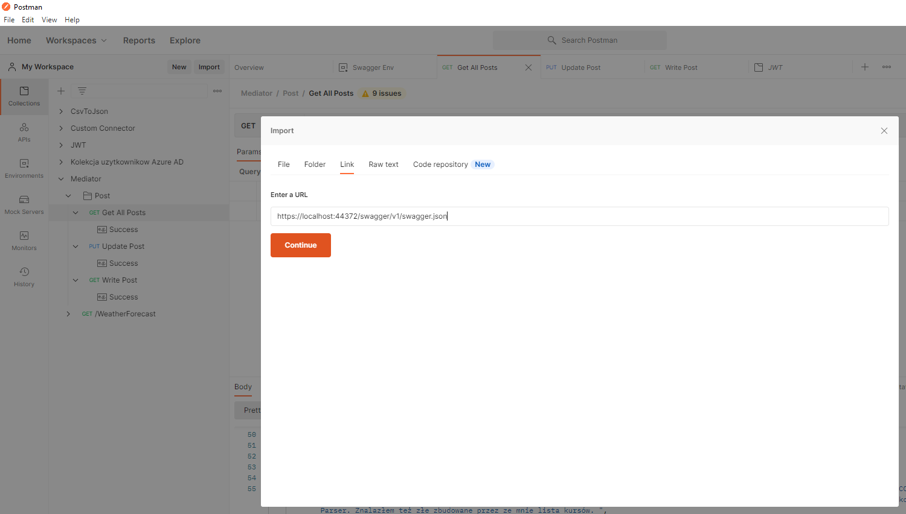

## How to import Swagger JSON to Postman?
1. Instalujemy NuGet Swashbuckle.

  

2. Konfigurujemy Swagger w pliku ```Startup.cs```
```
 public void ConfigureServices(IServiceCollection services)
        {
            /* ... */
            services.AddSwaggerGen(c =>
            {
                c.SwaggerDoc("v1", new OpenApiInfo { Title = "Mediator", Version = "v1" });
            });

        }

        // This method gets called by the runtime. Use this method to configure the HTTP request pipeline.
        public void Configure(IApplicationBuilder app, IWebHostEnvironment env)
        {
            if (env.IsDevelopment())
            {
                app.UseDeveloperExceptionPage();
                app.UseSwagger();
                app.UseSwaggerUI(c => c.SwaggerEndpoint("/swagger/v1/swagger.json", "Mediator v1"));
            }

            app.UseHttpsRedirection();

            app.UseRouting();

            app.UseAuthorization();

            app.UseEndpoints(endpoints =>
            {
                //endpoints.MapControllers();
                endpoints.MapControllerRoute(name:"api", pattern: "api/{controller}/{action}/{id?}");
            });
        }
    }
```
  
3. Po napisaniu API i uruchomieniu aplikacji z zainstalowanym NuGet Swashbuckle powinna wyrenderować się podobna strona:  
  
  
4. Pobieramy plik ```swagger.json``` lub pobieramy link do lokalizacji z tym plikiem.  
  
  
4. Uruchamiamy program Postman i wciskamy przycisk Import  
  
  
5. Importujemy plik: swagger.json  
  
  
6. Otrzymana kolekcja wymaga jeszcze zdefiniowania zmiennej środowiskowej ```baseUrl```.  
  
  
 