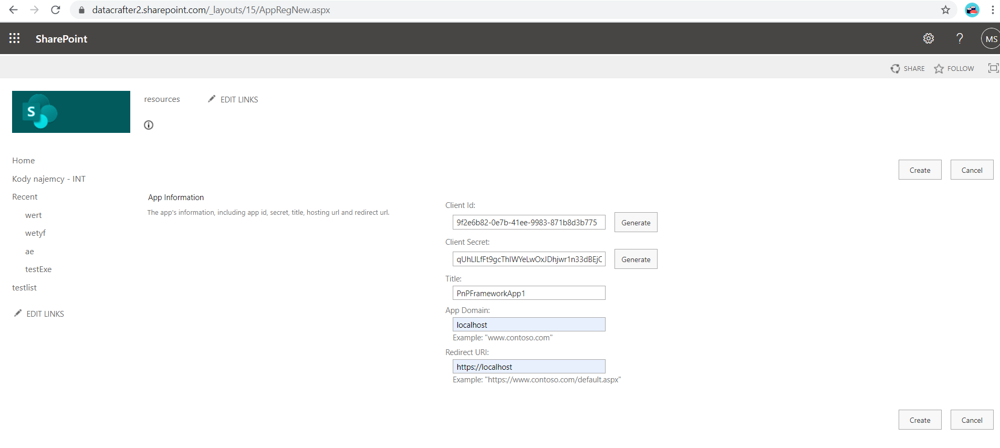
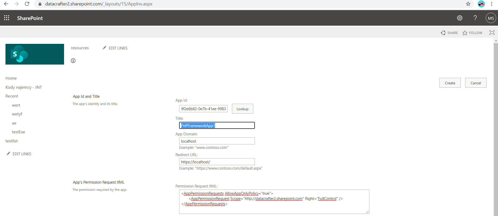
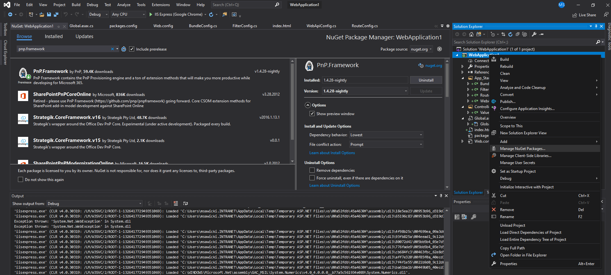

## 1. Rejestrujemy aplikacje na naszym SharePoint Tenant.  
https://datacrafter2.sharepoint.com/_layouts/15/AppRegNew.aspx  



Możemy sprawdzić na tym etapie za pomocą PowerShell czy poprawnie zarejestrowaliśmy aplikację.
```
Connect-PnPOnline -Url https://datacrafter2.sharepoint.com -ClientId 9f2e6b82-0e7b-41ee-9983-871b8d3b7758 -ClientSecret "qUhLlLfFt9gcThIWYeLwOxJDhjwr1n33dBEjOqHzEz4="
```

## 2. Nadajemy uprawnienia naszej aplikacji.  
https://datacrafter2.sharepoint.com/_layouts/15/AppInv.aspx  



```
<AppPermissionRequests AllowAppOnlyPolicy="true">
       <AppPermissionRequest Scope="http://datacrafter2.sharepoint.com" Right="FullControl" />
</AppPermissionRequests>
```
## 3. Zakładamy projekt ASP.NET Web Application (.NET Framework) - Web API  
## 4. Pobieramy NuGet PnPFramework  


## 5. Tworzymy metodę GET kontrolera Values i pobieramy nazwę oraz numer identyfikacyjny listy SharePoint.  
```
using System;
using System.Collections.Generic;
using System.Security;
using System.Web.Http;
using PnP.Framework;

namespace WebApplication1.Controllers
{
    public class ValuesController : ApiController
    {
        // GET api/values
        public IEnumerable<string> Get()
        {
            var ctx = new PnP.Framework.AuthenticationManager().GetACSAppOnlyContext("https://datacrafter2.sharepoint.com", "9f2e6b82-0e7b-41ee-9983-871b8d3b7758", "qUhLlLfFt9gcThIWYeLwOxJDhjwr1n33dBEjOqHzEz4=");
            ctx.Load(ctx.Web);
            ctx.ExecuteQuery();
            var lista = ctx.Web.GetList("Lists/testlist");
            ctx.Load(lista);
            ctx.ExecuteQuery();
            string numerListy = lista.Id.ToString();
            string nazwaListy = lista.Title;
            return new string[] { numerListy, nazwaListy };
        }
    }
}
```
## 6. Źródło  
https://docs.microsoft.com/en-us/sharepoint/dev/solution-guidance/security-apponly-azureacs  
