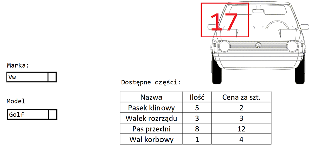

# Zadanie 1.  
(TypeScript)

Utworzenie na własnym tenancie SharePoint aplikacje ‘Kalkulator’ na siteCollection kalulator.  
Utworzyc ‘Page’ sharepoint oraz osadzic na nim webpart z kodem JavaScript. Kod będzie umieszczony w pliku calculator.js.  
Plik ten wdrożony będzie do styli sharepoint, do katalogu JS.  

Zadanie  polega na utworzeniu trzech list sharepoint, pierwsza lista będzie zawierala kolekcje liczb. 
Druga lista będzie zawierala kolekcje liczb. Trzecia lista wynik, na początku będzie pusta, ale aplikacja będzie zapisywala do niej wyniki.  

Aplikacje po kliknieciu przycisku „Pobierz liczbe1” pobierze i wyświetli na stronie SharePoint ta liczbe.  
Po ponownym kliknieciu „Pobierz liczbe1” pobierze i wyświetli nastepna w kolejności na liscie   
SharePoint liczbe. Podobnie będzie działał przycisk „Pobierz liczbe2”, ale będzie  pobieral z drugiej listy liczb.  

Dodatkowo będą dwa przyciski. Pierwszy przycisk ‘Sumuj’ zsumuje wyświetlone liczby, drugi przycisk ‘Zapisz’ zapisze wynik na liscie SharePoint.  

# Zadanie 2.
Utworzenie na własnym tenancie SharePoint aplikacje ‘Wall’ na siteCollection o nazwie 'wall'.
Utworzyc ‘Page’ SharePoint oraz osadzic na nim webpart z kodem JavaScript. 
Kod będzie umieszczony w pliku wall.js.

Plik ten wdrożony będzie do 'Style Library' SharePoint, do katalogu ITDev\JS.

Aplikacja daje możliwość dodawania wpisów na stronie przez użytkowników – przy wpisach jest możliwe polubienie lub odwołanie polubienia 
(polubienia sa zliczane i wyswietlane), można także usunąć wpis.

Dodatkowo po dodaniu wpisu, zapisuje sie on na liscie SharePoint.

Po uruchomeniu aplikacj, jesli sa juz jakies wpisy na liscie SharePoint to zostana one pobrane i wyrenderowane na stronie.

Dodatkowo uwzglęniamy obsługę błędów jeśli np. brak listy, brak elementów na liście.  

# Zadanie 3.

Aplikacja - Katalog części samochodowych w języku JavaScript.

Aplikacja wyrenderuje interfejs uzytkownika zgodny ze schematem na rysunku  

Dane o markach, modelach i dostepnych częściach samochodowych przechowywane są na listach SharePoint.
Zdjęcia lub schematy samochodów przechowywane sa w 'Picture Library'.

Ilosc wszystkich czesci jest podliczna i renderowana na obrazku (tak jak na przykadzie - czerwona liczba 17).

Do wyrenderowania kontrolki DropDownList i Grid powinna zostać użyta biblioteka Telerik Kendo.
Dwie powiazane ze soba kontroli DropDownList umożliwą wybor marki i modelu samochodu.
Kontrolka Grid bedzie wyswietlała odpowiednie części w zależności od dokonanego wyboru.

# Zadanie 4

WebJob na podstawie danych w polu [Title], [Copy sent] i [Expiration date] uzupełni pola [Message] i [Days to expiration].

Pole Message bedzie miało treść: "[Title] expired/not expired and copy was sent/not sent"
Pole "Days to expiration" to odjęcie aktualnej daty od 'Expiration date'.

Przykładowo na liscie SharePoint są takie dane i mamy dzis date 08/04/2020 (WebJob będzie modyfikował dane na podstawie aktualnej daty):

 Title | Message |Copy sent |Expiration date | Days to expiration
:-:|:-:|:-:|:-:|:-:|
Document 1 | "No message"|[+]|07/04/2020| -1
Document 2 | "No message" | [-] | 05/04/2020| 2
Document 3 | "No message" | [-] | 12/04/2020 | 4
Document 4 | "No message" | [+] | 06/04/2020 | 8

Po uruchomieniu WebJoba powinno to być ustawine w ten sposob:

 Title | Message |Copy sent |Expiration date | Days to expiration
:-:|:-:|:-:|:-:|:-:|
Document 1 | "Document 1 expired and copy was sent"|[+]|07/04/2020| -1
Document 2 | "Document 2 expired and copy was not sent" | [-] | 05/04/2020| -3
Document 3 | "Document 3 not expired and copy was not sent" | [-] | 12/04/2020 | 4
Document 4 | "Document 4 expired and copy was sent" | [+] | 06/04/2020 | -2

Ostatnim etapem zadania jest wdrożenie WebJob'a do Azure i konfiguracja w taki sposob, zeby uruchamiał sie co 10 minut.

Przykład WebJoba znajduje się w lokalizacji:

# Zadanie 5.

Program w języku C#. Projekt w .NET Core - (ASP.NET Core Web Application, template: API) 

(uwaga! domyslnie uzywany jest ASP.NET Core 3.1)

Docelowo program bedzie wdrozony do Azure jako: "Web App + SQL". 
Dla ułatwienia można rozpocząć pisanie programu używając bazy danych na localhost.  

[diagram-klas-zad3.jpg]

Dla przedstawionego diagramu klas napisać CRUD w języku C#, następnie wdrożyć ten serwis do Azure.
(poczytać na temat: dependency injection)

Odpytac serwis programem Postman i używając biblioteki MSTest przetestowac jedna dowolna metode kontrolera.

Materiały:
https://docs.microsoft.com/pl-pl/aspnet/core/tutorials/first-web-api?view=aspnetcore-3.1&tabs=visual-studio

Wykonać migracje do bazy danych (Code First).

Dopisac wlasna metode kontrolera która zwróci dane o pracowniku bez danych o departamencie.
Dopisać wlasna metodę kontrolera która obliczy ilosc dni urlopu wypisanych przez pracownika.

Dodanie kodu JS:
https://docs.microsoft.com/en-us/aspnet/core/tutorials/web-api-javascript?view=aspnetcore-3.1

Wyświetlić dane otrzymane z serwisu w tabeli za pomoca kodu w JavaScript i zapytania AJAX z biblioteki jQuery.

# Zadanie 6.
(PowerShell)

Utworzyc site collection o dowolnej nazwie, na utworzonym site collection utworzyc listę sharepoint o nazwie Explorer1 i dodac na niej 10 itemow. 
Dodatkowo utworzyć liste Explorer1_Archive.

Po dodaniu list oraz itemów napisać w języku PowerShell:

(a) skrypt który pobierze i wyswietli te 10 itemow w konsoli.
(b) funkcjonalność dodawania itemu do listy
(c) archiwizację itemów z listy Explorer1 tzn. przenieść zadaną liczbę itemów (np. 10 najstarszych itemów) na listę Explorer1_Archive
	Po wykonanen archiwizacji skrypt wygeneruje plik CSV z raportem na temat przeniesionych itemow:
	id, title, data, lista z ktorej archiwizowano, lista na ktora archiwizowano
(d) dane pobrane z pliku XML dodać do list SharePoint (plik CharakterystykaUpraw.XML)
(e*) dane uzyskane ze strony internetowej umieścić na liście SharePoint - może to być na przykład kurs dolara, pogoda we wrocławiu

* dodatkowe, dla chętnych

# Zadanie 7.
(C#, TypeScript)

Napisac obieg faktur, w tym celu zaimplementować WebAPI które będzie zmieniało stan faktur.
Dane o fakturach znajdują się na listach SharePoint.

Faktury maja 4 stany: 
(stan 1) Do weryfikacji
(stan 2) Do opisu
(stan 3) Do zatwierdzenia opisu
(stan 4) Do księgowania

Dla każdego stanu faktur utworzona jest strona na której wyrenderowany jest Kendo Grid z informacjami o fakturze.
Użytkownik może przechodzić do kolejnych do stron przez boczne menu nawigacyjne.

 LP | Nazwa faktury | Kontrahent | Kwota netto | Kwota brutto | Stan | Akcja |
:--:|:-------------:|:----------:|:-----------:|:------------:|-----:|:-----:|
1 :|: Invoice 1 :|: 10,20 :|: 0,00 :|: 1 :|: [Skieruj do opisu]
2 :|: Invoice 2 :|: 12,50; 0,00 :|: 1 :|: [Skieruj do opisu]
3 :|: Invoice 3 :|: 5,36; 0,00 :|: 1 :|: [Skieruj do opisu]

Naciśnięcie przycisku w wierszu danej faktury w kolumnie z akcja spowoduje wyrenderowanie okna z upewnienem sie co do wyboru użytkownika.
Jeśli użytkownik potwierdzi dokonany wybór poprzez naciśnięcie przycisku 'OK' to faktura zmieni stan za pośrednictwem WebAPI.

Dodatkowo WebAPI przy zmianie stanu sprawdzi wyliczoną kwotę brutto zakładając podatek VAT dla wszystkich kwot netto 23%, jeśli wartość 
w polu kwota brutto będzie niepoprawna to przeliczy i uzupełni w bazie danych poprawną wartość.

# Zadanie 8
Sklep internetowy

Napisać sklep internetowy z możliwością dodawania artykułów do koszyka.

Zaproponować sposób autentykacji i rejestracji nowych użytkowników.

# Zadanie 9:
(TypeScript)

1.	Ze strony http://jsonplaceholder.typicode.com/posts pobieramy dane. (można też użyć własnego serwisu)
2.	Na podstawie pobranych danych tworzymy stronę przedstawioną poniżej: 

 [Obrazek1.png]

Legenda:
1.	"userId" – nazwa użytkownika
	"title" – tytuł postu
	"body" – treść postu
	"id" – id obiektu
	
2.	Nagłówek strony
3.	Treść postu

4.	Przycisk 'Like' którego nacisnięcie powoduje przekazanie do metody id obiektu
	
Wykonujemy dwa zapytania do serwisu. 

Informacje o users pobieramy pierwszym zapytanie, a informacje o posts pobieramy drugim zapytaniem.

Proszę pamiętać o  SOLID i przechwytywaniu błędów 
(defensive programming, np. wyświetlić odpowiedni komunikat że nie udało się pobrać żadnych danych).

Dodatkowe wymagania:
- testy dwóch wybranych funkcjonalnosci za pomocą Jasmine

- zastosowanie wzorców projektowych

- Dzielimy pliki na Klasy/Funkcjonalności czyli w jednym pliku ma znajdować się jedna klasa która jest odpowiedzialna za jedną 
  rzecz (single responsibility principle) np. klasa która jest odpowiedzialna za pobranie danych, 
  plik  w którym będziemy przechowywać konfigurację tj. Url, templates HTML

- Funkcję która pobiera dane to Promise.

- W main.ts powinna znajdować się tylko i wyłącznie funkcja inicjalizująca cały program która przyjmuje konfigurację.

- do tworzenia bundle JS uzywamy Webpack'a

- program wdrażamy do własnego tenanta SharePoint, kod powinien znajdować się na site collection 'cdn',
  a sama aplikacja na site collection 'wiadomosci'

# Zadanie 10.

Na liscie SharePoint 'Cases' przechowywane sa numery cases (spraw) oraz linki do utworzonych dla cases sitecollections.

Napisać Azure Function, które utworzy sitecollection (zbiór witryn) po nacisnięciu przycisku 'Create Case Site'.

Nazwa sitecollection zostanie wygenerowana na podstawie listy 'Cases' i bedzie miała format: 
Case-[XXXX] 

np. Case-0001, Case-0002
 
# Zadanie 11.

Aplikacja losuje zajete miejsca w samolocie i zaznacza je na schemacie kolorem czerwonym.

Schemat samolotu i rozkład dostępnych miejsc dostępny jest w pliku:
[EN_A320_168-nose.png]

https://www.lufthansa.com/us/en/320

Uzytkownik klikajac na wolne miejsce, wybiera je i uzyskuje o nim informacje w Kendo Grid:

Nr miejsca; Strefa; Czy dostępne; Cena;

Dane o miejscach sa umieszczone na liscie SharePoint.

Dodatkowo uzytkownik ma mozliwosc wyboru z DropDownList:
Bagaż; Bagaż podręczny, Bez bagażu

Po dokonaniu wyboru miejsca oraz bagażu wylicza się cena biletu która zostanie wyrenderowana w kontenerze div o id="total".

Poprzez użycie MutationObserver, aplikacja zareaguje na pojawienie się w DOM elementu 
 poprzez wyrenderowanie
przycisku "Wprowadź dane ponownie" oraz przycisku "Złóż zamówienie".

Naciśnięcie przycisku "Wprowadź dane ponownie" umożliwi ponowne dokonanie wyborów.

Naciśnięcie przycisku "Złóż zamówienie" zapamięta dane o wybranym miejscu w localStorage spowoduje pojawienie się okna z napisem 'Złożono zamówienie' i przyciskiem 'OK'.
Naciśnięcie 'OK' umożliwi ponowne wprowadzenie danych.

Historia wcześniej dokonanych wyborów zostanie wyświetlona i wyrenderowana po naciśnięciu przycisku 'Historia'.
Kasowanie historii następuje po naciśnięciu przycisku 'Usuń historię'.

# Zadanie 12.

Napisac aplikacje w ktorej uzytkownik moze w wybrac nazwe pomieszczenia z DropDownList (nazwy pomieszczen sa pobierane z listy SharePoint).
Po dokonaniu wyboru na obrazku [buildingScheme.jpg] (obrazek zostanie pobrany z SharePoint Picture Library) 
zaznaczony zostanie kolorem czerwonym obrys pomieszczenia. 
Zaznaczanie obrysu mozna zrealizowac poporzez uzycie 'Canvas' w HTML5.

W kontrolce Kendo Grid wyrenderowane zostana informacje na temat pomieszczenia (te informacje takze sa pobierane z listy SharePoint):

Nazwa pomieszczenia; Powierzchnia; Ilosc okien; Ilosc drzwi;

Dodatkowo zostaną wyrenderowane dwa przyciski z następującymi funkcjonalnościami.

(a) 'Znajdź ścieżkę'
Zaimplementować algorytm wyszukiwania najkrótszej ścieżki. 
Ścieżka będzie wyliczana i narysowana na planie budynku.
Punkt startowy i koncowy będzie wybierany przez uzytkownika po naciśnięciu przycisku 'Znajdz ścieżkę'.

(b) 'Przeszukaj budynek robotem ratownikiem'
Zaimplementować algorytm który wyśle do budynku robota ratownika, który przeszuka wszystkie pomieszczenia 
w celu znalezienia rannych w wyniku trzęsienia Ziemii.
Podczas przeszukiwania budynku będzie widzoczny procentoway pasek postepu obrazujący ilość przeszukanego obszaru oraz czas poświęcony na poszukiwania.

(c) 'Przeszukaj budynek oddziałem ratowniczym'
Zaimplementować algorytm który wyśle do budynku oddział ratowniczy składający się określonej liczby robotów,
który przeszuka wszystkie pomieszczenia w celu znalezienia rannych w wyniku trzęsienia Ziemii.

Liczbę ratowników określa użytkownik systemu wpisując dowolną liczbę większą od 1. 
 
Podczas przeszukiwania budynku będzie widzoczny procentoway pasek postepu obrazujący ilość przeszukanego obszaru oraz czas poświęcony na poszukiwania.

